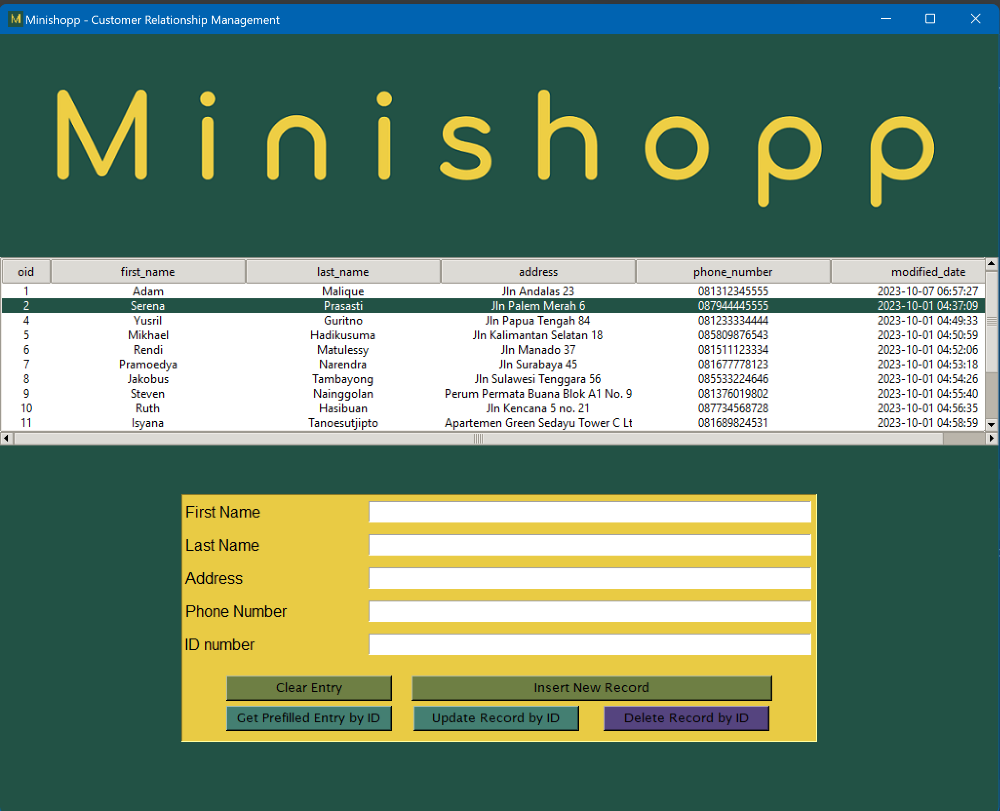

# Minishopp - Customer Relationship Management
Python Tkinter project: a simple app to insert/update/delete SQLite database record of fictional shop customers.

## Fictional user story
Minishopp manager needs an app to keep, add, and edit digital record of their customers' name, address, and phone numbers.

## Solution
Our app is built using Python Tkinter for its graphical interface, and SQLite database for its data storage. User may insert new customer record, update, or delete it by its ID number.
Check out our demo app in [Replit](https://replit.com/@JenniferLorenza/tkinter-shop-customers-management).

The main table that stores customers data is named `ms_customers`, which has columns of:
| Column name   | Description   |
| ------------- | ------------- |
| `oid`         | automatically-generated ID number for each row data  |
| `first_name`  | customer's first name (required)  |
| `last_name`   | customer's last name |
| `address`     | customer's address |
| `phone_number`| customer's phone number (required) |
| `modified_date`| automatically-generated date timestamp of row data creation or modification |

Notice that in our app there are entries for customer's first name, last name, address, phone number, and ID number (oid) corresponding to `ms_customers` columns.

### Inserting new customer record
To insert a new customer data, user is required to fill the `First Name` and `Phone Number` entries before clicking `Insert New Record` button. Other entries such as `Last Name` and `Address` may be filled, but is not mandatory. Since our database automatically generate `oid` for each new row data, the `ID Number` entry value is unused.

### Getting Prefilled Entry & Updating Customer Record by ID
Our app's mechanism to update data requires ID number and assumes every entry value (even if it is blank) as the updated value. Therefore, in order to preserve data in unchanged entry/column, prior updating it is important to ensure that every entry is **pre-filled** with its original value from database. From there on, user may change any entry value accordingly and do update.

To get prefilled entry by ID number (oid), user is required to fill the `ID Number` entry before clicking `Get Prefilled Entry by ID` button. Our app uses the `ID Number` entry value as the key to search customer data in the database.

After that, every entry is pre-filled with its original value from database. User may change any entry value accordingly. Remember that `ID Number` entry value is required as the key to update a customer data, and it is not possible to change it. Click `Update Record by ID` button to do update.

### Delete Customer Record by ID
To delete an existing customer data, user is required to fill the `ID Number` entry before clicking `Delete Record by ID` button. Other entries are unused.
